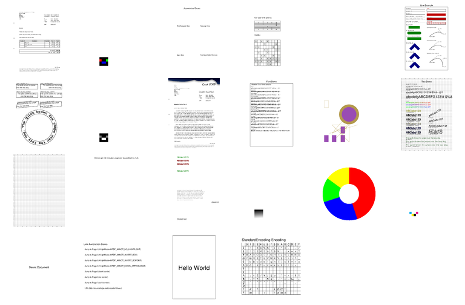

# hpdf [](https://github.com/threez/hpdf.cr/actions/workflows/ci.yml) [](https://threez.github.io/hpdf.cr/)

Shard to create PDF documents with crystal using [libharu/libhpdf](https://github.com/libharu/libharu/).

Example renderings of the example files and specs: 

[](pdfs).

## Installation

1. Add the dependency to your `shard.yml`:

   ```yaml
   dependencies:
     hpdf:
       github: threez/hpdf.cr
   ```

2. Run `shards install`

## Usage

```crystal
require "hpdf"

pdf = Hpdf::Doc.build do
  page do
    draw_rectangle 50, 50, width - 100, height - 110

    text Hpdf::Base14::Helvetica, 70 do
      text_out :center, :center, "Hello World"
    end
  end
end

pdf.save_to_file "hello.pdf"

```

## C library dependencies

Before usage you have to install the library **libharu** which
depends on **libpng** and **zlib**:

<table>
<thead>
<tr><th>System</th><th>Command</th></tr>
</thead>
<tbody>
<tr><td>Alpine</td><td><code>apk add libharu</code></td></tr>
<tr><td>Debian/Ubuntu</td><td><code>sudo apt install libhpdf-dev</code></td></tr>
<tr><td>Centos</td><td><code>sudo yum install libharu-devel</code></td></tr>
<tr><td>Fedora/Redhat</td><td><code>sudo dnf install libharu-devel</code></td></tr>
<tr><td>FreeBSD</td><td><code>pkg install libharu</code></td></tr>
<tr><td>OpenBSD</td><td><code>pkg_add libharu</code></td></tr>
<tr><td>macOS</td><td><code>brew install libharu</code></td></tr>
<tbody>
</table>

## Development

Use the examples to write demos. Read about *libharu* here:

* http://libharu.sourceforge.net/index.html
* https://github.com/libharu/libharu/wiki

## Contributing

1. Fork it (https://github.com/threez/hpdf.cr/fork)
2. Create your feature branch (`git checkout -b my-new-feature`)
3. Commit your changes (`git commit -am 'Add some feature'`)
4. Push to the branch (`git push origin my-new-feature`)
5. Create a new Pull Request

## Contributors

- [Vincent Landgraf](https://github.com/threez) - creator and maintainer
